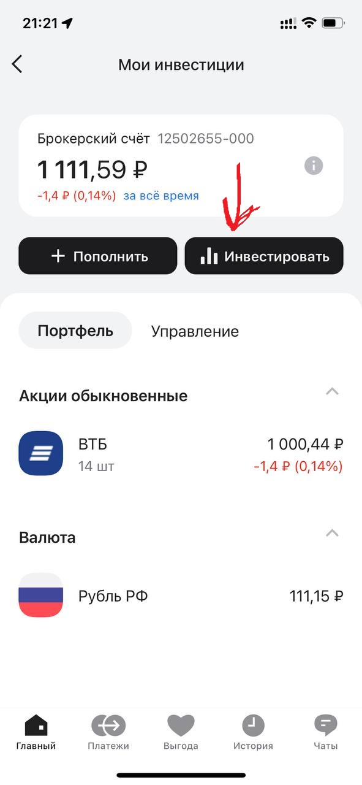
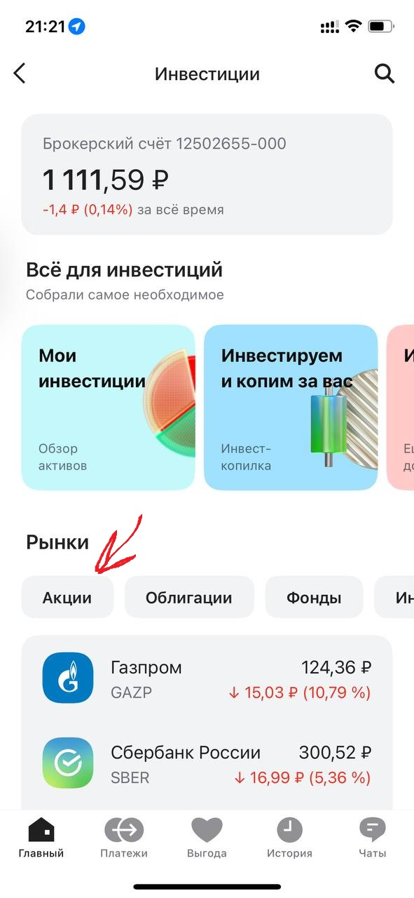
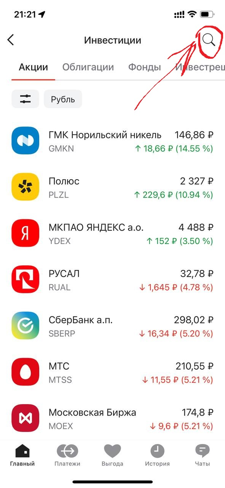
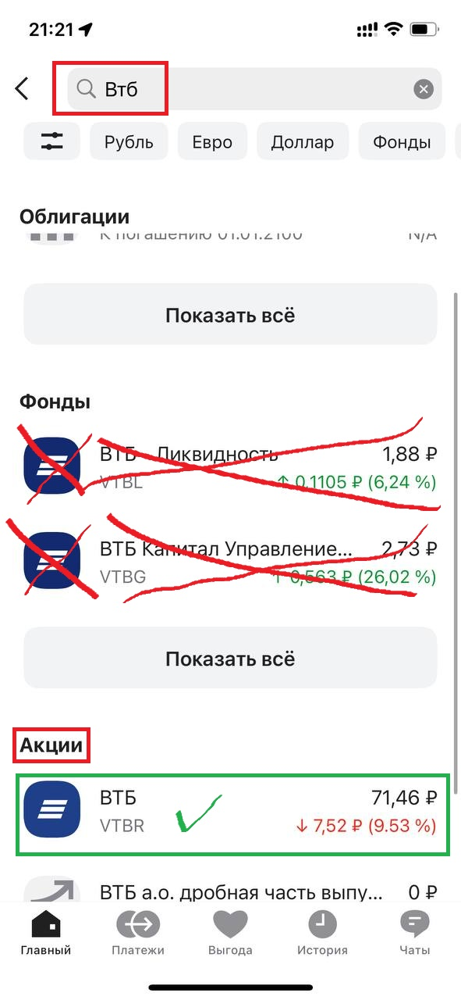
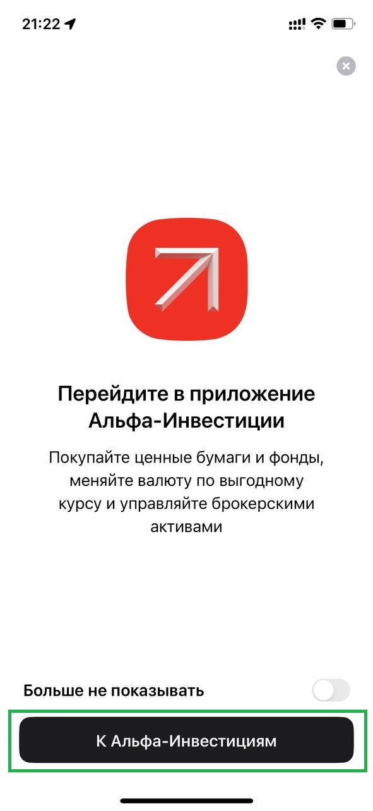
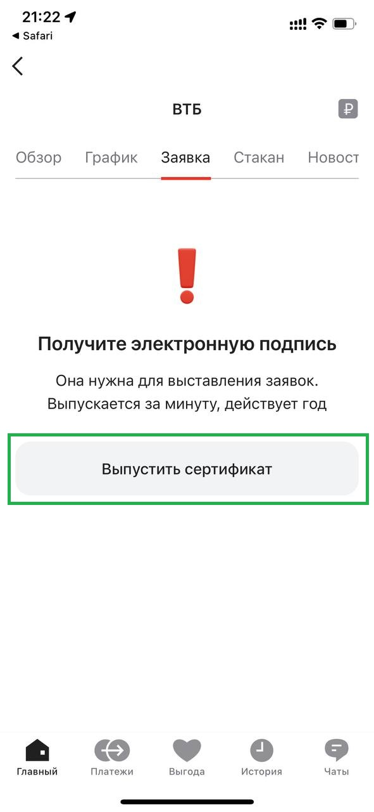
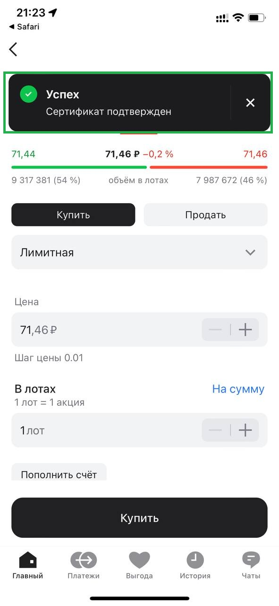
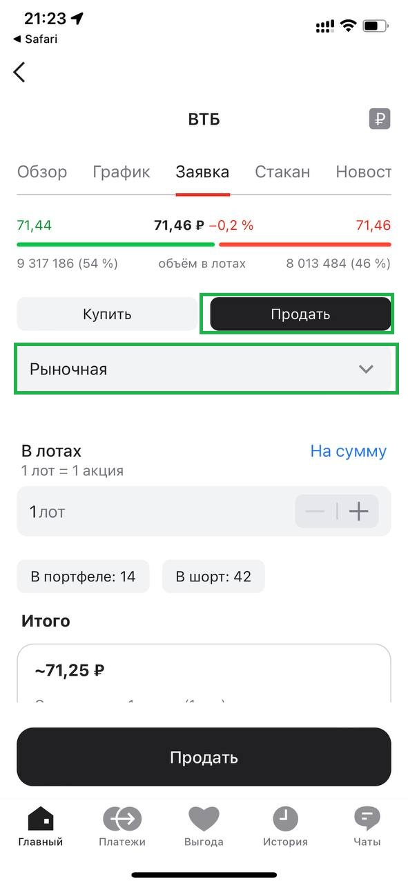
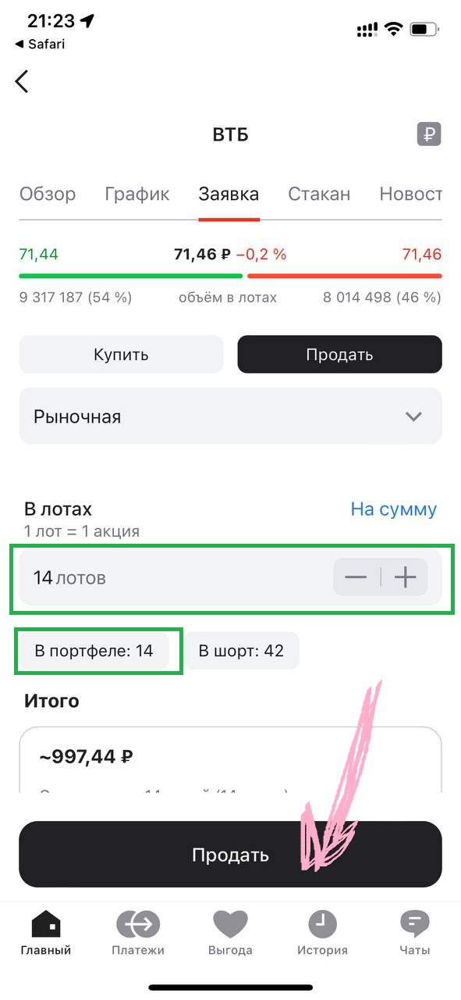

# Инструкция по покупке и продаже акций в Альфа‑Инвестициях

Автор: **Бызов Александр Андреевич**

## Коротко о правилах акции
По условиям акции клиент ежемесячно получает бонус от **500 до 5000 ₽** (в зависимости от месяца).  
Чтобы бонус начислялся, нужно **каждый месяц** совершать покупку акций на сумму **от 1001 ₽** (или на сумму, которую мы согласовали на встрече).  
**Дополнительное пополнение** брокерского счёта обычно **не требуется** — используются уже имеющиеся средства.

> **Важно:** если пропустить хотя бы один месяц, в следующем месяце бонус **не начислится**.

---

## Часть 1. Продажа акций

### Шаг 1. Откройте брокерский счёт и нажмите «Инвестировать»

### Шаг 2. Выберите «Акции»

### Шаг 3. Нажмите на поиск

### Шаг 4. Введите в поиске «ВТБ» и выберите акцию

### Шаг 5. Дождитесь загрузки страницы инвестиций (может открыться отдельным экраном/вкладкой)

### Шаг 6. Если требуется — выпустите электронный сертификат (ЭП)
Если сертификат уже выпускали ранее, этот шаг появиться не должен.

### Шаг 7. Подтвердите сертификат кодом из СМС
После ввода кода появится уведомление об успешном подтверждении.

### Шаг 8. Нажмите «Продать»

### Шаг 9. Тип заявки — «Рыночная»

### Шаг 10. Укажите количество из строки «В портфеле» и подтвердите продажу
Продажа происходит **моментально**.

---

## Часть 2. Покупка акций

После продажи нужно **купить эти же акции** на сумму, о которой мы договаривались (обычно **от 1001 ₽**).

1. Нажмите **«Купить»**.
2. Тип заявки выберите **«Рыночная»**.
3. Нажимайте **«+»**, чтобы увеличить количество.
4. Проверьте, чтобы итоговая сумма была **более 1000 ₽**.
5. Убедитесь, что покупка **успешно отобразилась** в приложении.

---

## Напоминание
Повторяйте алгоритм **каждый месяц** (5–10 месяцев, в зависимости от условий, которые мы обсуждали), пока не получите весь бонус на брокерский счёт.  
Главное — **не пропускать месяцы**.
